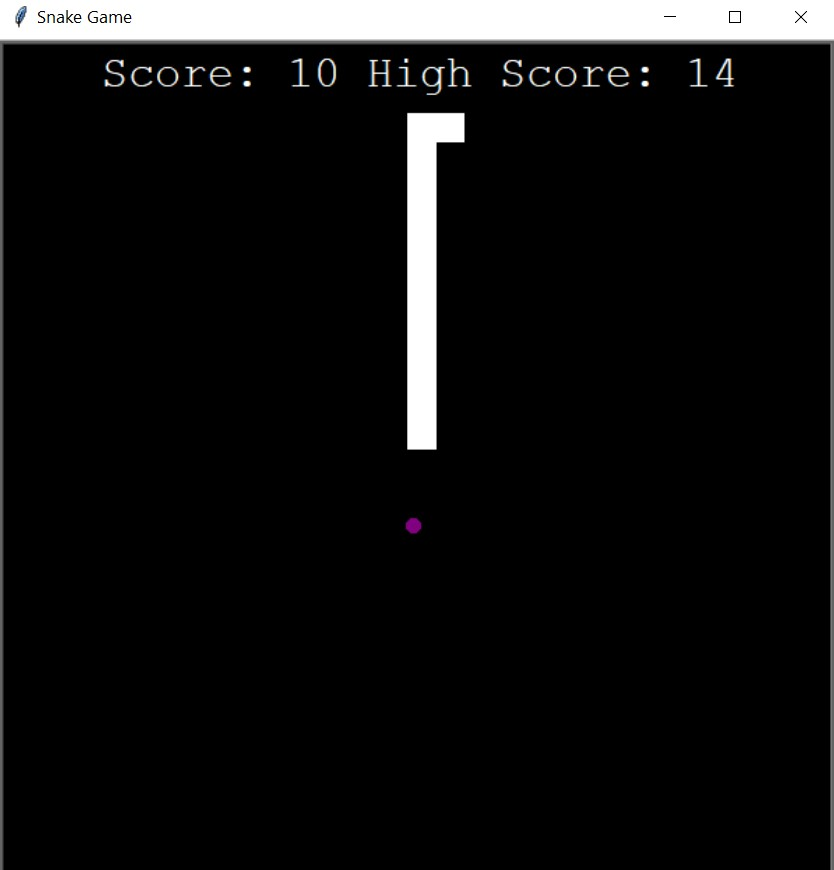

# Simple Snake Game
---
This is a project that was created as a consolidation of the material from an online Python course. This is an attempt to create the well-known Snake game. Additionally, the highest score created by the user in the game is saved in this project.

## Technologies
---
Project is created with: 
+ Pyhon 3.10

## How to run the project:
---
```
git clone https://github.com/Karola97/Snake.git
cd snake_game
snake.py
```
## How to play the game:
---
+ run the game
+ tart playing using the arrows keys

---
